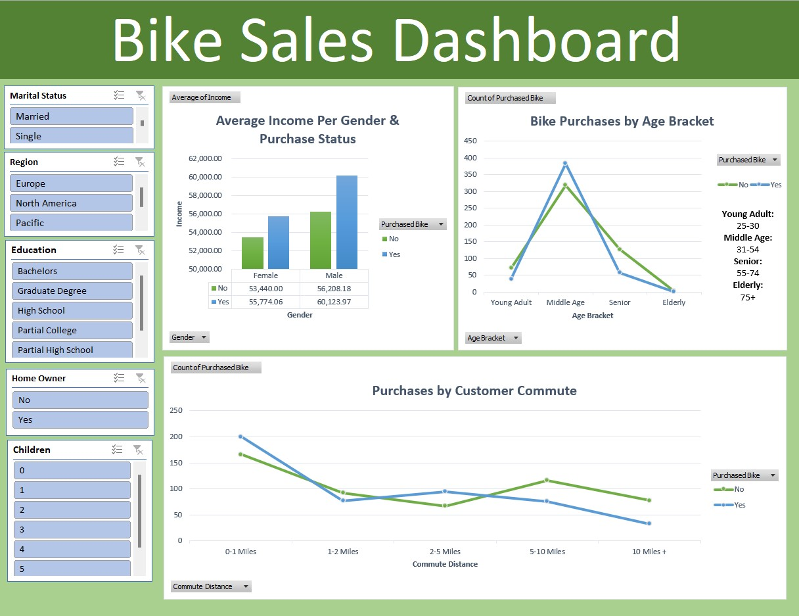

# Bike Sales Dashboard - Excel
This project was completed in Excel to find patterns in bike purchase trends to improve marketing strategies. This analysis could also be used as a basis for further exploration into how to best utlize public transportation systems and pedestrian/cyclist facilities.

The Excel file which includes both the data and dashboard are availbe in this repository.

## Summary
Data was sourced from "Alex the Analyst" on YouTube.

## Skills Used in Excel
- Data Cleaning
- Data Validation
- Data Visualization
- Pivot Tables
- Formulas (SUMIFS, COUNT, CORREL, custom calculations)

## Dashboard Sample

